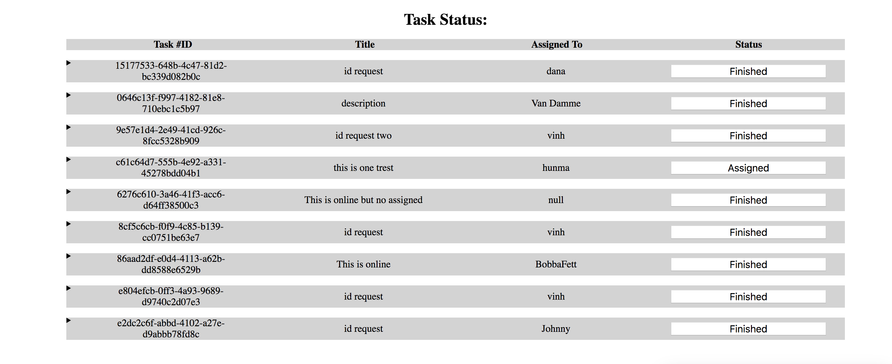

# taskmaster-frontend

http://taskmaster-front.s3-website-us-west-2.amazonaws.com/

## Intro

This is a React based front end application.

The application retrieves a list of tasks from a backend application @
http://taskmaster-dev.us-west-2.elasticbeanstalk.com/tasks/ and renders the list of tasks
in summary form. Expand the details caret to see the task description.

Click on the Status button to advance the state of the task. If the task is in avalaible mode,
the application will prompt for a name to assign the task to.

## Backend Application

https://github.com/nguyenvinh2/taskmaster

## Visual
